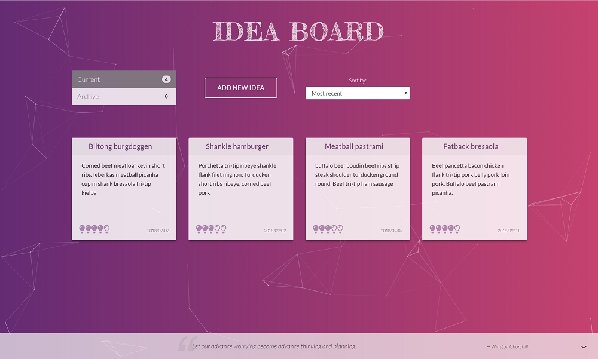

# Idea Board

The idea board app displays idea tiles, which can be rated, archived, and sorted. You can create, modify, and delete ideas. A daily motivational quote is displayed in a sticky footer, which can be toggled in and out of view. The background is created with Particles.js to create a fluid environment for free-flowing thought.



## Getting Started

These instructions will get you a copy of the project up and running on your local machine for development and testing purposes.

### Prerequisites

Install Node.js to access the package manager

### Installing

Install dependencies

```
npm install
```

Start server

```
node index.js
```

```
nodemon
```

Start client

```
npm start
```

## Built With

- [MongoDB](https://www.mongodb.com/) - The database
- [Express](https://expressjs.com/) - The web framework
- [React](https://reactjs.org/) - The front-end framework
  - [Redux](https://redux.js.org/) - State management
  - [Redux-Saga](https://redux-saga.js.org/) - Side effects management
- [Node](https://nodejs.org/en/) - Dependency Management
- [Particles.js](https://github.com/VincentGarreau/particles.js/) - Background particles animation
- [They Said So Quotes API](https://quotes.rest/) - Daily motivational quote

## Acknowledgments

Inspiration from Hrishi Mittal's Medium article, [✅ Every time you build a to-do list app, a puppy 🐕 dies 😢](https://medium.freecodecamp.org/every-time-you-build-a-to-do-list-app-a-puppy-dies-505b54637a5d)
